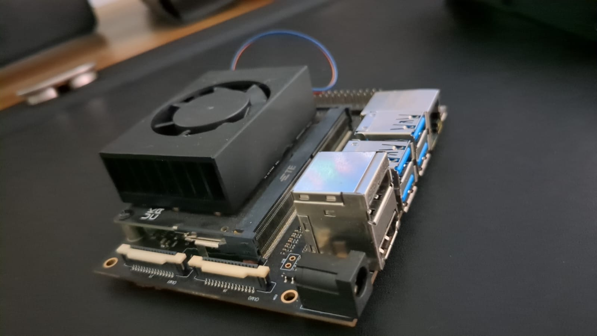

# Baby on the run

## Project Goal

To develop a JetBot powered by NVIDIA Jetson Nano capable of tracking a baby in a controlled environment and emitting alerts in cases of potentially dangerous situations.
Creating this robot involves a comprehensive software development process that begins with Linux-based setup of the full range of hardware capabilities offered by NVIDIA, particularly CUDA for the development of AI models. These models are crucial for identifying dangerous environments, a key feature underpinned by computer vision technology. Additionally, the system should incorporate a tracking mechanism that can not only follow the baby but also be attentive to its immediate surroundings.

The use of CUDA (Compute Unified Device Architecture) allows for leveraging NVIDIA's powerful GPUs, thereby accelerating the machine learning models that power both the tracking and danger identification systems. This is particularly important for real-time operation, where delays in processin

### Software Architecture Overview

Linux Setup and Hardware Integration: The first step would be setting up the NVIDIA Jetson Nano with all the required Linux-based software, including CUDA libraries and other dependencies.

Computer Vision Models:

Baby Tracking: One or more models will be trained to accurately track the baby's position within a certain environment.
Danger Identification: Another set of models will be focused on identifying potentially dangerous situations, such as proximity to stairs, open doors, or hazardous objects.
Tracking System: This involves integrating the baby tracking model into the JetBot’s control system, allowing it to move autonomously while maintaining a safe distance from the baby.

Alert Mechanism: This system will utilize the danger identification models to issue real-time alerts. It could involve visual signals, sound alerts, or even mobile notifications for the parents.

Data Management: Handling the data flow between the computer vision models, the tracking system, and the alert mechanism in a seamless and secure manner.

User Interface: Optionally, a user interface could be developed to allow parents to monitor the JetBot's tracking and alert status.

By integrating these components, the JetBot can achieve the objective of autonomously tracking the baby and providing real-time safety alerts, leveraging NVIDIA's CUDA for high-performance computing capabilities.

## Jetbot

[Documentation](https://jetbot.org/master/)

## Computer Vision Models

## Testing

[Video]()

## Releases

## Reference 

* Hands-On Machine Learning with Scikit Learn, keras & Tensorflow, Géron A. (2023)
* Practical Machine learninig for Computer Vision, Lakshmanan (2021)
* Linear Algebra and Optimization for Machine Learning, Aggarwal C, (2022)

### Projects Reference
 * [Jetbot](https://www.youtube.com/watch?v=byGZt5ZYup0)
